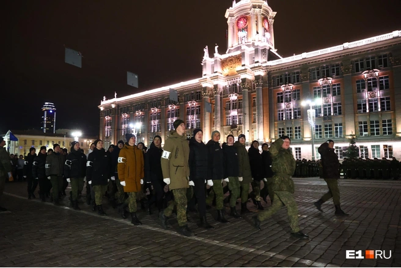

```python
import libr
print('hello')
```
My last week consisted of studying, training and watching the preparations for the Victory Day parade.

## Study  

Last week I studied new topics in mathematical analysis and mathematical logic, dealt with algorithms and solved interesting problems. There were many practical works that helped to deepen knowledge and skills in the field of information technology. 
 
## Fitness aerobics training as part of the national team

In addition to studying, I spent time training. This is a great way to keep fit and recharge your batteries for the whole day. There were a lot of funny moments in training that will definitely be recalled more than once in the future. 
 
## Going to the parade rehearsal

The final, but no less important event of the week was my trip to the rehearsal of the Victory Day parade. It was a truly impressive event. The Victory Parade is one of the most significant and honorable events in Russia dedicated to the memory of the heroes of the Great Patriotic War.


 
Watching the parade rehearsal, I couldn't help but admire the careful preparation of the military units, the skill and coordination of the participants. Military equipment, soldiers in uniform, musicians - everything created a unique atmosphere of celebration and memory. 
 
I was amazed by the greatness and heroism of those who participated in the parade. Seeing it all live was incredibly exciting and touching. Every step, every melody called for the preservation of the memory of the great victory and respect for those who gave their lives for our future. 

I am proud to be a spectator at such a landmark event and once again felt how important it is to remember and honor the exploits of our ancestors. I hope that each of us will be able to pass this story on to future generations and keep the memory of the great Victory in the hearts of every person.

## Let's sum up the results

Thus, the past week has been eventful and interesting. Useful time is spent both studying and training, as well as with pleasant emotions. 
The time was spent usefully, I was energized for the next week!!!
