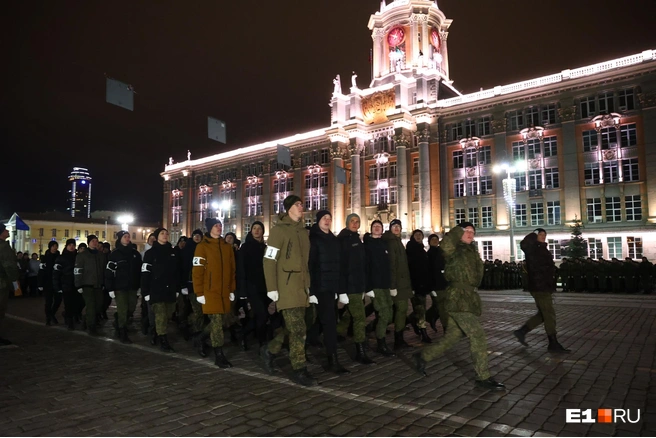

```python
import libr
print('hello')
```
Моя прошедшая неделя состояла из учебы, тренировок и просмотра подготовки к параду, посвященному Дню Победы.

## Учеба  

На прошедшей неделе я изучала новые темы по математическому анализу и математической логике, разбиралась с алгоритмами и решала интересные задачи. Было много практических работ, которые помогли углубить знания и навыки в области информационных технологий. 
 
## Тренировки по фитнес-аэробике в составе сборной

Помимо учебы, уделял время тренировкам. Это отличный способ поддерживать физическую форму и зарядиться энергией на целый день. На тренировках происходило много смешных моментов, которые обязательно в будущем будут не раз напоминаться. 
 
## Поход на репетицию парада

Завершающем, но от этого не менее важным событием недели был мой поход на репетицию парада ко Дню Победы. Это было поистине впечатляющее событие. Парад Победы - это один из самых значимых и почетных мероприятий в России, посвященных памяти героев Великой Отечественной войны. 


 
Наблюдая за репетицией парада, я не могла не восхищаться тщательной подготовкой военных частей, мастерством и слаженностью действий участников. Военная техника, солдаты в форме, музыканты - все создавало неповторимую атмосферу праздника и памяти. 
 
Я был поражен величием и героизмом тех, кто участвовал в параде. Видеть все это вживую было невероятно волнующим и трогательным. Каждый шаг, каждая мелодия призывали к сохранению памяти о великой победе и уважению к тем, кто отдал свои жизни за наше будущее. 

Я горжусь возможностью быть зрителем на таком знаковом событии и вновь почувствовал, как важно помнить и чтить подвиги наших предков. Надеюсь, что каждый из нас сможет передать эту историю будущим поколениям и сохранить память о великой Победе в сердцах каждого человека.

## Подведём итоги

Таким образом, прошедшая неделя была насыщенной и интересной. Полезное время проведено как в учебе, так и в тренировках, а также с приятными эмоциями. 
Время было проведено с пользой, я зарядилась энергией на следующую неделю!!!
