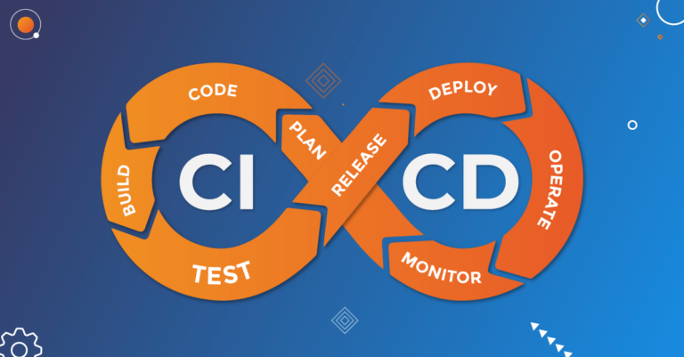

    

    
## Что это такое?

Непрерывная интеграция и непрерывное развертывание (CI/CD) – это методология разработки программного обеспечения, которая позволяет автоматизировать процессы сборки, тестирования и развёртывания приложений. Основной принцип CI/CD заключается в интеграции кода в общий репозиторий и его автоматическом тестировании, после чего происходит автоматическое развертывание приложения на тестовых и продуктовых средах.

## Какие плюсы в себе несёт?

Эти практики позволяют сократить время между написанием кода и его выкладыванием в продакшн, упростить процесс обновления и масштабирования приложений, а также повысить качество проекта благодаря регулярному тестированию.

CI/CD помогает разработчикам быстрее реагировать на изменения требований заказчика, быстрее реагировать на ошибки и быстрее внедрять новые функции. Этот подход также способствует снижению рисков, связанных с развертыванием приложений, и позволяет эффективнее управлять всем циклом разработки.

## Подведём итоги

Применение непрерывной интеграции и непрерывного развертывания помогает улучшить процесс разработки программного обеспечения, сделать его более прозрачным и предсказуемым, а также повысить качество и надёжность создаваемых приложений. Получить преимущество в конкурентной борьбе для разработчиков и компаний в целом.
