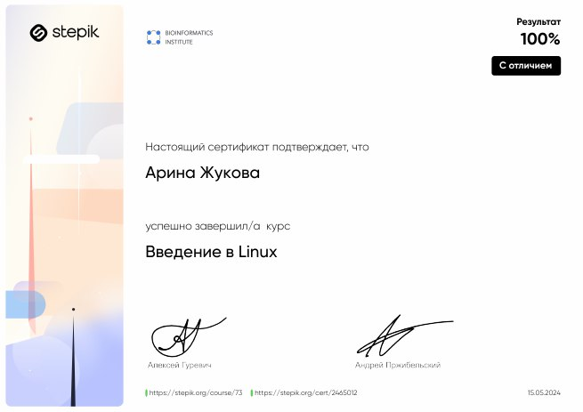

Не так давно я завершила прохождение курса "Введение в Linux" на платформе Stepik и хотела бы поделиться своими впечатлениями. Этот курс оказался очень полезным для меня, даже учитывая, что ранее у меня уже был опыт работы с операционной системой Linux в первом семестре.

Курс начинается с базовой информации о Linux, что идеально подходит для новичков. Одной из первых тем стала установка Linux на мой компьютер. Инструкции были четкими и понятными, что позволило мне без проблем выполнить эту задачу и закрыть имеющиеся у меня проблемы в знаниях и недопонимание.

Одним из аспектов, который мне особенно понравился, было изучение работы в терминале. Это, несомненно, является ключевым навыком для работы с Linux, и курс предлагает множество практических упражнений, которые действительно помогли мне освоить этот инструмент.

Курс также включает в себя тему работы с удаленными серверами, что является важным навыком в современном мире IT. Хотя эта тема может показаться сложной для начинающих, авторы курса объясняют ее на доступном языке, что делает процесс обучения комфортным и эффективным.

Стоит отметить, что курс не претендует на полноту освещения всех аспектов Linux, но предоставляет достаточно знаний для начала работы с этой операционной системой. Я надеюсь, что в будущем Stepik предложит и более продвинутые курсы по Linux, которые я с радостью пройду.

В целом, я очень довольна курсом "Введение в Linux" на Stepik. Он хорошо структурирован, содержит множество практических примеров и заданий, что делает обучение интересным и увлекательным. 

!!! Рекомендую этот курс всем, кто хочет начать работать с Linux или просто расширить свои знания в области операционных систем !!!

https://stepik.org/cert/2465012

# Отчёт

https://disk.yandex.ru/i/-lvm8Vi6Z8OxGA

# Видеозаписи пояснения ответов и впечатления

https://youtu.be/ik93cwOfL_c

## Раздел 1

<figure> 
  <video controls> 
    <source src="Video1.mp4" type=video/mp4> 
  </video> 
  <figcaption>Раздел 1</figcaption> 
</figure>

## Раздел 2

<figure> 
  <video controls> 
    <source src="Video2.mp4" type="video/mp4"> 
  </video> 
  <figcaption>Раздел 2</figcaption> 
</figure>

## Раздел 3

<figure> 
  <video controls> 
    <source src="Video3.mp4" type="video/mp4"> 
  </video> 
  <figcaption>Пояснения по выбранным ответам раздела 3 и общее впечатление от курса</figcaption> 
</figure>

# А также ссылки на видеозаписи прохождения курса
Раздел 1. https://youtu.be/XIC75vUwsqM 
 
https://rutube.ru/video/private/be8e57beb19c22f7c947ca1b31896505/?p=DK3ch4cEOHjPgLTTFaHO_A 
 
Раздел 2. https://youtu.be/GEw8HJ0xy9A 
 
https://rutube.ru/video/private/384742aad0312009adfd58a4433fecf4/?p=e79m_47VjkcwUyAxbnDvLw 
 
Раздел 3. https://youtu.be/k0rfT9t8s2c 
 
https://rutube.ru/video/private/a3410d7f7e57458e960d82a1572227e3/?p=eIPuZ_GyE_fWNTYTYBPFMg
